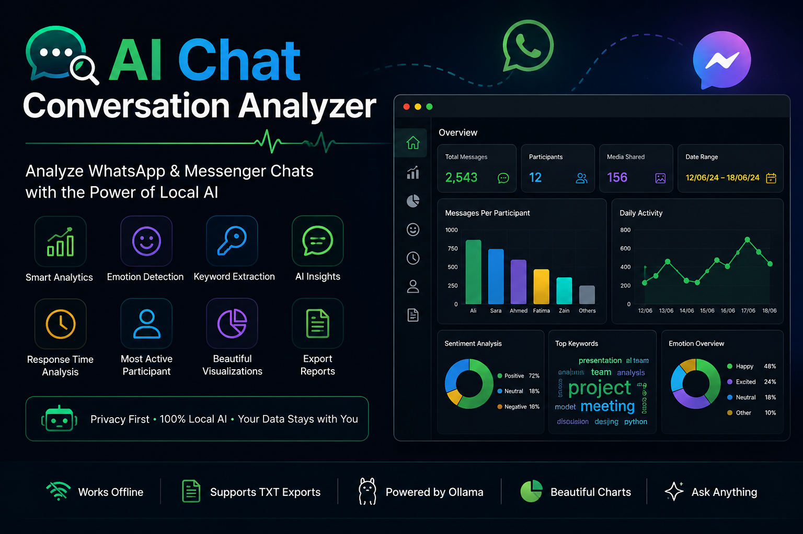

<div align="center">



# 💬 AI Chat Conversation Analyzer

### 🤖 Analyze WhatsApp & Messenger Chats using Local AI (Ollama + Streamlit)

[](https://www.python.org/)
[](https://streamlit.io/)
[](https://ollama.com/)
[](#-license)
[]()

⭐ **If you like this project, don't forget to Star the Repository!** ⭐

[Features](#-features) •
[Demo](#-application-preview) •
[Installation](#%EF%B8%8F-installation) •
[How It Works](#-how-it-works) •
[Author](#-author)

</div>

---

# 📌 Project Overview

**AI Chat Conversation Analyzer** is an AI-powered desktop web application built using **Python, Streamlit, and Ollama**.

It enables users to upload exported **WhatsApp** or **Messenger** chat files and instantly analyze conversations using a **Local Large Language Model (LLM)**.

The application automatically extracts participants, messages, timestamps, keywords, emotions, conversation topics, and statistics before generating intelligent AI insights.

Unlike cloud-based AI services, this project runs **100% locally** with **Ollama**, ensuring that conversations remain completely private and never leave your computer.

Whether you're analyzing team discussions, classroom chats, customer conversations, or personal messages, the application provides quick and meaningful insights in just a few seconds.

---

# ✨ Features

| Feature | Description |
|----------|-------------|
| 💬 Chat Upload | Upload WhatsApp or Messenger exported chat (.txt) |
| 🤖 AI Conversation Summary | Summarizes long conversations into concise overviews |
| 😊 Emotion Detection | Detects overall emotions and mood |
| 📊 Sentiment Analysis | Identifies positive, negative, or neutral conversations |
| 👤 Most Active Participant | Finds the participant with the highest activity |
| 🔑 Keyword Extraction | Extracts the most important keywords |
| 🎯 Topic Detection | Detects discussion topics automatically |
| 💡 AI Insights | Provides communication insights and suggestions |
| 📈 Chat Statistics | Total messages, participants, words and activity |
| 📥 Download Report | Export AI-generated analysis |
| 🌙 Modern UI | Beautiful dark-themed Streamlit interface |
| 🔒 Local AI | Runs completely offline using Ollama |

---

# 🖥 Application Preview

<div align="center">

| Dashboard | AI Summary | Statistics |
|-----------|------------|------------|
|  |  |  |

</div>

> **Replace the placeholder screenshots above with your own images stored inside the `screenshots/` folder.**

---

# 🚀 How It Works

```text
Upload WhatsApp / Messenger Chat
              │
              ▼
      Parse Chat Messages
              │
              ▼
 Extract Participants & Statistics
              │
              ▼
     Generate Visual Charts
              │
              ▼
      Send Prompt to Ollama
              │
              ▼
        AI Conversation Analysis
              │
              ▼
 Summary • Sentiment • Keywords
 Emotion • Insights • Topics
              │
              ▼
      Display & Export Report
```

---

# 🧠 AI Capabilities

The Local AI model can perform:

- 📄 Conversation Summarization
- 😊 Emotion Detection
- 📊 Sentiment Analysis
- 👤 Most Active Participant Detection
- 🔑 Keyword Extraction
- 🎯 Topic Detection
- 💡 AI Insights
- 📈 Communication Analysis
- ❓ Ask AI About Conversation
- 📥 Report Generation

---

# 📂 Project Structure

```text
AI-Chat-Conversation-Analyzer/
│
├── assets/
│   └── banner.png
│
├── screenshots/
│   ├── dashboard.png
│   ├── statistics.png
│   ├── summary.png
│   └── upload.png
│
├── app.py
├── analyzer.py
├── chat_parser.py
├── charts.py
├── prompts.py
├── requirements.txt
├── README.md
└── .gitignore
```

---

# ⚙️ Installation

## 1️⃣ Clone the Repository

```bash
git clone https://github.com/yourusername/AI-Chat-Conversation-Analyzer.git
cd AI-Chat-Conversation-Analyzer
```

---

## 2️⃣ Create a Virtual Environment

### Windows

```bash
python -m venv .venv
.venv\Scripts\activate
```

### Linux / macOS

```bash
python3 -m venv .venv
source .venv/bin/activate
```

---

## 3️⃣ Install Dependencies

```bash
pip install -r requirements.txt
```

---

# 🦙 Install Ollama

This project uses **Ollama** to run a Local Large Language Model (LLM) on your computer.

Download Ollama from:

👉 https://ollama.com/download

Verify installation:

```bash
ollama --version
```

---

# 📥 Download an AI Model

Download your preferred model:

```bash
ollama pull llama3.2:1b
```

Other supported models:

- llama3.2
- llama3.1
- mistral
- gemma
- phi3

---

# ▶️ Start Ollama

Run:

```bash
ollama serve
```

If Ollama is running successfully, the application sidebar will display:

```
🟢 Ollama Online
```

---

# 🚀 Run the Application

Start the Streamlit app:

```bash
streamlit run app.py
```

If `streamlit` is not recognized:

```bash
python -m streamlit run app.py
```

The application will open automatically in your browser:

```
http://localhost:8501
```

---

# 📋 Supported Chat Formats

| Chat Format | Supported |
|-------------|-----------|
| WhatsApp (.txt) | ✅ |
| Messenger (.txt) | ✅ |
| Telegram Export | ❌ |
| Discord Export | ❌ |

---

# 💡 Example Workflow

### Step 1

Export your WhatsApp or Messenger conversation as a **.txt** file.

↓

### Step 2

Upload the chat into the application.

↓

### Step 3

The application automatically parses:

- Participants
- Messages
- Dates
- Time
- Total words

↓

### Step 4

Visual statistics are generated instantly.

↓

### Step 5

Click **🚀 Analyze Conversation**.

↓

### Step 6

The AI generates:

- 📄 Summary
- 😊 Emotion Analysis
- 📊 Sentiment
- 🎯 Main Topics
- 🔑 Keywords
- 💡 AI Insights

↓

### Step 7

Ask custom questions using the **Ask AI** feature.

↓

### Step 8

Download the AI-generated report.

---

# 💻 Technologies Used

| Technology | Purpose |
|------------|---------|
| Python | Backend Programming |
| Streamlit | Web Application |
| Ollama | Local AI Model |
| Pandas | Data Processing |
| Matplotlib | Data Visualization |
| Requests | Ollama API Communication |
| Regular Expressions | Chat Parsing |

---

# 📦 Python Modules

```text
streamlit
pandas
matplotlib
requests
```

All required packages are listed in **requirements.txt**.

---

# 🔥 Key Highlights

✅ AI-powered conversation analysis

✅ Completely offline using Ollama

✅ Privacy-friendly (No cloud APIs)

✅ WhatsApp & Messenger support

✅ Conversation summarization

✅ Emotion detection

✅ Sentiment analysis

✅ Topic detection

✅ Keyword extraction

✅ Most active participant detection

✅ Interactive statistics

✅ Downloadable reports

✅ Modern dark-themed UI

---

# 🎯 Use Cases

This project is useful for:

- 📚 Students analyzing group discussions
- 👨‍💻 Developers reviewing team communication
- 🏢 Businesses monitoring customer conversations
- 📈 Researchers studying communication patterns
- 🎓 Educational chat analysis
- 💼 Team collaboration insights
- 📱 Personal conversation summaries
- 🤖 AI & NLP learning projects

---

---

# 🔮 Future Improvements

The following features are planned for future releases:

- 🌍 Multi-language Chat Analysis
- 📱 Telegram & Discord Chat Support
- 📊 Interactive Analytics Dashboard
- ☁ Cloud Deployment (Streamlit Cloud, Render, Hugging Face)
- 👥 User Authentication & Profiles
- 💾 Chat History Management
- 📄 PDF Report Generation
- 🎤 Voice Message Analysis
- 🖼 OCR Support for Image Messages
- 📷 Media & Attachment Analysis
- 😊 Emoji Usage Analysis
- 📈 Conversation Trend Visualization
- 🤖 Multiple AI Model Support
- 🔍 Advanced Search & Filtering
- 📱 Mobile-Friendly Responsive Interface

---

# ❓ Frequently Asked Questions (FAQ)

<details>
<summary><strong>Does this application upload my chats to the internet?</strong></summary>

No.

All conversations are processed locally using **Ollama**. Your chat data never leaves your computer, ensuring complete privacy.

</details>

---

<details>
<summary><strong>Does this application work offline?</strong></summary>

Yes.

After installing Ollama and downloading the AI model, the application works completely offline.

</details>

---

<details>
<summary><strong>Which chat formats are supported?</strong></summary>

Currently supported:

- ✅ WhatsApp (.txt)
- ✅ Messenger (.txt)

Support for Telegram and Discord exports is planned for future versions.

</details>

---

<details>
<summary><strong>Can I use another AI model?</strong></summary>

Yes.

You can use any Ollama-supported model such as:

- llama3.2
- llama3.1
- mistral
- gemma
- phi3

Simply download the model using Ollama and select it in the application.

</details>

---

<details>
<summary><strong>Is the AI analysis always accurate?</strong></summary>

The AI provides intelligent summaries and insights, but results may vary depending on the quality and context of the conversation. Always verify important information manually.

</details>

---

# 🤝 Contributing

Contributions are always welcome!

If you'd like to improve this project:

### 1️⃣ Fork the repository

### 2️⃣ Create a feature branch

```bash
git checkout -b feature-name
```

### 3️⃣ Commit your changes

```bash
git commit -m "Add new feature"
```

### 4️⃣ Push to GitHub

```bash
git push origin feature-name
```

### 5️⃣ Open a Pull Request

Every contribution helps improve this project.

---

# 🐞 Report Issues

Found a bug?

Have an idea for a new feature?

Please open an Issue on GitHub describing the problem or your suggestion.

Your feedback is greatly appreciated.

---

# 📄 License

This project is licensed under the **MIT License**.

You are free to:

- ✅ Use
- ✅ Modify
- ✅ Share
- ✅ Distribute

for educational and personal purposes.

Please refer to the **LICENSE** file for more details.

---

# 👩‍💻 Author

## **Mahrukh Aijaz**

🎓 BS Artificial Intelligence Student

🏫 Pak Austria

📍 Haripur, Pakistan

---


# 💖 Support This Project

If you found this project useful, please consider giving it a ⭐ on GitHub.

Your support motivates me to create more AI and Machine Learning projects.

---

# 🙏 Acknowledgements

Special thanks to the amazing open-source community and the developers of:

- Python
- Streamlit
- Ollama
- Pandas
- Matplotlib
- Requests

Their incredible work made this project possible.

---

# ⭐ Show Your Support

If you like this repository:

⭐ Star this repository

🍴 Fork this project

🐞 Report bugs

💡 Suggest new features

📢 Share it with others

Every contribution helps this project grow.

---

<div align="center">

# 💬 AI Chat Conversation Analyzer

### Built with ❤️ using Python, Streamlit & Ollama

⭐ **If you like this project, don't forget to Star the Repository!**

---

### Thank you for visiting this repository!

Happy Coding! 🚀

© 2026 Mahrukh Aijaz. All Rights Reserved.

</div>
